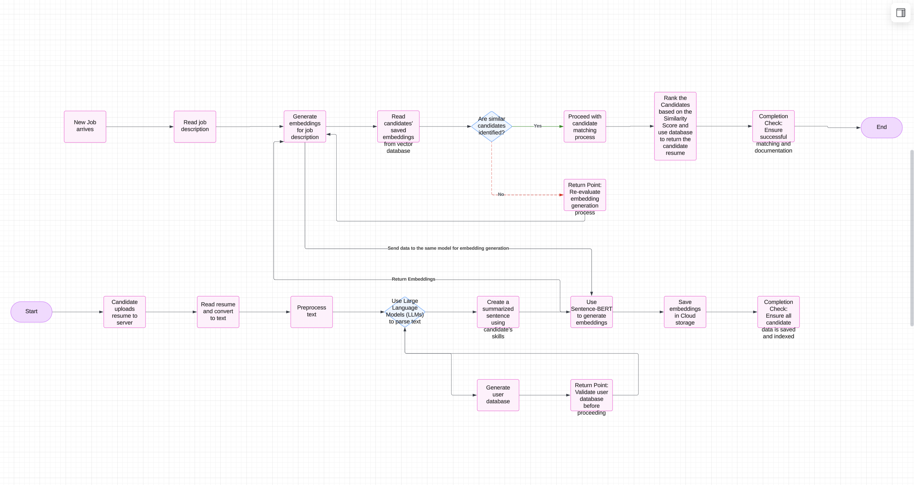

# Match Making Pipeline

This repository contains a pipeline to process resumes from PDF to structured JSON data, generate embeddings, index them using FAISS, and run queries for candidate matching.

---

## Table of Contents

- [Overview](#overview)
- [Features](#features)
- [Directory Structure](#directory-structure)
- [Installation](#installation)
- [Configuration](#configuration)
- [Usage](#usage)
  - [1. Split PDF and Clean Text](#1-split-pdf-and-clean-text)
  - [2. Extract Data Using LLM](#2-extract-data-using-llm)
  - [3. Extract JSON Data and Create Summaries](#3-extract-json-data-and-create-summaries)
  - [4. Generate Embeddings](#4-generate-embeddings)
  - [5. Index Embeddings in FAISS](#5-index-embeddings-in-faiss)
  - [6. Run API / Interactive Search](#6-run-api--interactive-search)
- [Example Commands](#example-commands)
- [License](#license)

---

## Overview

This project automates the following steps for resume processing:
1. **Splitting PDF** files into individual pages/resumes.
2. **Converting PDFs to clean text**.
3. **Extracting structured data** from resumes using an LLM (Large Language Model).
4. **Generating embeddings** for each candidate’s summary text.
5. **Indexing** the embeddings using **FAISS** for vector similarity.
6. **Running interactive or API-based queries** to match candidates against a job description.

---

## Features

- **Parallel processing** of resumes for faster LLM calls.
- **Config-driven** approach (using YAML) for flexible setup (paths, model names, LLM endpoints, etc.).
- **FAISS** integration for efficient vector similarity search.
- **Logging** for tracking and debugging.

---

## Directory Structure

```bash
.
├── config
│   ├── config.yaml            # Main configuration file
│   └── schema.json            # JSON schema for extracted resume data
├── src
│   ├── data_ingestion.py      # Functions to handle PDF splitting & text extraction
│   ├── preprocessing.py       # Clean and preprocess resume text
│   ├── extraction.py          # Functions to call LLM server & parse responses
│   ├── embedding.py           # Embedding model wrapper & FAISS ingestion
│   ├── matching.py            # Candidate profile creation, similarity search
│   └── utils.py               # Helper functions (load_config, setup_logger)
├── utils
│   └── parse_json_chatgpt.py  # Utility parser for ChatGPT-like JSON response
├── main.py                    # Main CLI script
├── requirements.txt           # Python dependencies (example)
├── README.md                  # (This file)
└── ...
```
---
# Installation and Enviroment activation
Create environment and install all required libraries
```
./setup_env.sh
```
---
# Usage
You control the pipeline by running main.py with specific arguments. Key command-line options include:




## function:
* split_pdf: Splits PDF and cleans text.
* extract_data: Sends text to LLM for structured extraction and writes results.
* json_extract: Parses the LLM result to extract final JSON objects and creates a consolidated CSV.
* generate_embeddings: Embeds candidate summaries and stores them.
* index_embeddings: Builds a FAISS index from the embeddings.
* run_api: Loads the FAISS index for interactive queries or an API service.
--file: (Optional) A specific filename to process. Defaults to None (process all).

--config: The path to your YAML config file. Defaults to config/config.yaml.

--resume: (Optional) Boolean-like argument (True or False) to resume partial extraction if some resumes are already processed.

# Steps

1. Split PDF and Clean Text
```
python main.py --function split_pdf \
               --config config/config.yaml
```
#
2. Extract Data Using LLM
```
python main.py --function extract_data \
               --config config/config.yaml \
               --resume False

If --resume True, it will process only new files that haven’t been processed before.
```
#
## LLM API 
I am **Open chat 3.5** Model for this particular project. hosting of this model was done using ANACONDA AI NAVIGATOR.<br>
** Note ** 
We can Create our own docker and use that for this purpose.
#

3. Extract JSON Data and Create Summaries
```
python main.py --function json_extract
```
4. Generate Embeddings
```
python main.py --function generate_embeddings 
```
5. Index Embeddings in FAISS
```
python main.py --function index_embeddings
```
6. Run API / Interactive Search
```
python main.py --function run_api 
```
7. Get Insights
```
python main.py --function get_insights 
```
#
# Example Commands
```
# 1. Split PDFs & Clean
python main.py --function split_pdf

# 2. Extract Data from each .txt
python main.py --function extract_data --resume False

# 3. Generate Final JSON + Summaries
python main.py --function json_extract

# 4. Generate Embeddings
python main.py --function generate_embeddings

# 5. Index in FAISS
python main.py --function index_embeddings

# 6. Run Interactive Search
python main.py --function run_api
```

License
This project is licensed under the Personal License. You can not update or replace this license as needed.
